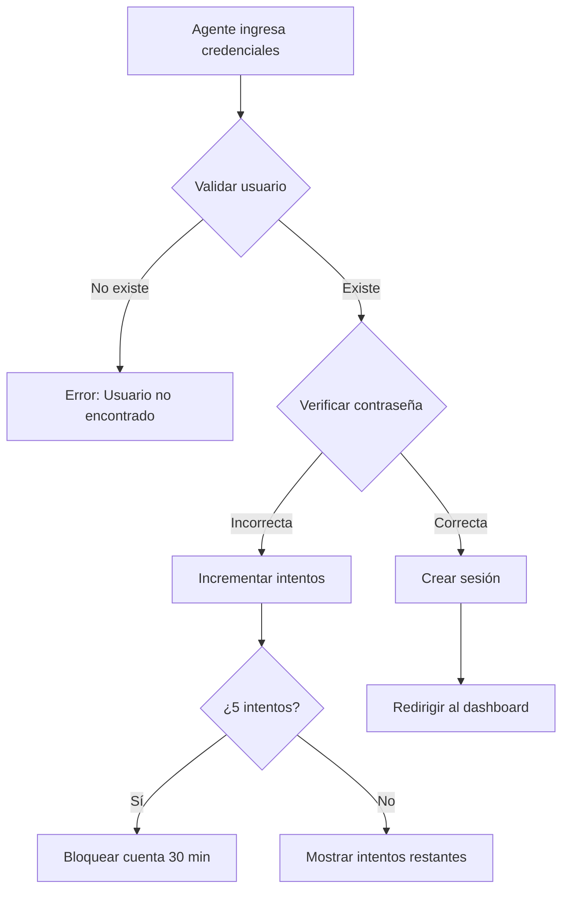

# 🚀 Sistema de Login de Agentes - ON PropTech

## 📋 Descripción

Sistema de autenticación súper novedoso, único y profesional para agentes inmobiliarios. Caracterizado por su diseño moderno, seguridad avanzada y experiencia de usuario excepcional.

## ✨ Características Principales

### 🎨 Diseño y UX
- **Interfaz Glassmorphism**: Efectos de cristal con backdrop-blur
- **Animaciones Fluidas**: Partículas animadas y transiciones suaves
- **Gradientes Dinámicos**: Fondos con gradientes que cambian
- **Responsive Design**: Adaptable a todos los dispositivos
- **Modo Oscuro**: Interfaz optimizada para uso nocturno

### 🔐 Seguridad Avanzada
- **Autenticación de Dos Factores**: Preparado para 2FA
- **Bloqueo por Intentos**: Bloqueo automático después de 5 intentos fallidos
- **Sesiones Seguras**: Tokens JWT con expiración automática
- **Encriptación SSL/TLS**: Comunicación segura
- **Validación de Contraseñas**: Indicador de fortaleza en tiempo real

### 🎯 Funcionalidades Únicas
- **Acceso Biométrico**: Simulación de autenticación por huella
- **Indicador de Seguridad**: Niveles de seguridad visuales
- **Contador de Tiempo**: Tiempo restante de sesión
- **Estado del Sistema**: Indicadores de estado en tiempo real
- **Notificaciones Toast**: Mensajes de error/éxito elegantes

## 🏗️ Arquitectura del Sistema

### 📁 Estructura de Archivos
```
src/app/(dashboard)/catalogs/agents/
├── components/
│   ├── AgentLoginForm.tsx      # Formulario principal de login
│   ├── AgentSessionStatus.tsx  # Estado de sesión del agente
│   ├── AgentDashboard.tsx      # Dashboard personalizado
│   ├── AgentForm.tsx           # Formulario de gestión de agentes
│   ├── AgentTable.tsx          # Tabla de agentes
│   ├── AgentStats.tsx          # Estadísticas
│   ├── AgentFilters.tsx        # Filtros
│   ├── AgentModal.tsx          # Modal de edición
│   ├── AgentViewModal.tsx      # Modal de visualización
│   └── DeleteConfirmationModal.tsx
├── services/
│   └── agentService.ts         # Servicios de autenticación y CRUD
├── hooks/
│   └── useAgents.ts            # Hook personalizado
├── types.ts                    # Tipos TypeScript
├── login/
│   └── page.tsx                # Página de login
└── page.tsx                    # Página principal de gestión
```

### 🔧 Tecnologías Utilizadas
- **Next.js 14**: Framework React con App Router
- **TypeScript**: Tipado estático
- **Tailwind CSS**: Estilos y animaciones
- **LocalStorage**: Persistencia de datos
- **React Hooks**: Gestión de estado
- **CSS Animations**: Efectos visuales personalizados

## 🚀 Instalación y Uso

### 1. Acceso al Sistema
```bash
# URL del login de agentes
http://localhost:3000/catalogs/agents/login

# URL de gestión de agentes (admin)
http://localhost:3000/catalogs/agents
```

### 2. Crear un Agente
1. Ir a `/catalogs/agents`
2. Hacer clic en "Crear Nuevo Agente"
3. Completar el formulario con:
   - Información personal
   - Credenciales de acceso
   - Asignación de agencia
   - Configuración de seguridad

### 3. Login del Agente
1. Ir a `/catalogs/agents/login`
2. Ingresar usuario y contraseña
3. Opcional: Usar acceso biométrico
4. Sistema redirige al dashboard personalizado

## 🔐 Sistema de Autenticación

### Flujo de Login


### Gestión de Sesiones
- **Duración**: 24 horas
- **Renovación**: Automática con actividad
- **Expiración**: Logout automático
- **Múltiples sesiones**: Soporte para varios dispositivos

### Seguridad
- **Hash de contraseñas**: Base64 (demo) / bcrypt (producción)
- **Tokens únicos**: Generación aleatoria
- **Validación de sesión**: Verificación en cada request
- **Logout seguro**: Limpieza de tokens

## 📊 Dashboard de Agentes

### Características del Dashboard
- **Resumen Personal**: Estadísticas del agente
- **Acciones Rápidas**: Acceso directo a funciones
- **Actividad Reciente**: Timeline de acciones
- **Estado de Sesión**: Tiempo restante y logout
- **Notificaciones**: Alertas en tiempo real

### Métricas Mostradas
- Propiedades asignadas
- Clientes activos
- Visitas programadas
- Ventas realizadas
- Último acceso

## 🎨 Personalización

### Colores y Temas
```css
/* Gradientes principales */
--primary-gradient: linear-gradient(135deg, #667eea 0%, #764ba2 100%);
--secondary-gradient: linear-gradient(135deg, #f093fb 0%, #f5576c 100%);

/* Estados de seguridad */
--security-low: #ef4444;
--security-medium: #f59e0b;
--security-high: #10b981;
```

### Animaciones Disponibles
- `animate-slide-in`: Entrada deslizante
- `animate-fade-in-up`: Fade con movimiento
- `animate-pulse-glow`: Pulsación con brillo
- `animate-float`: Flotación suave
- `animate-shimmer`: Efecto brillante

## 🔧 Configuración Avanzada

### Variables de Entorno
```env
# Configuración de seguridad
NEXT_PUBLIC_MAX_LOGIN_ATTEMPTS=5
NEXT_PUBLIC_LOCK_DURATION=1800000
NEXT_PUBLIC_SESSION_DURATION=86400000

# Configuración de UI
NEXT_PUBLIC_ENABLE_BIOMETRIC=true
NEXT_PUBLIC_ENABLE_ANIMATIONS=true
```

### Personalización de Estilos
```css
/* Agregar al archivo globals.css */
.agent-theme {
  --agent-primary: #667eea;
  --agent-secondary: #764ba2;
  --agent-success: #10b981;
  --agent-warning: #f59e0b;
  --agent-error: #ef4444;
}
```

## 🐛 Solución de Problemas

### Errores Comunes

#### 1. "Controlled/Uncontrolled Input"
```typescript
// Solución: Usar nullish coalescing
value={formData.field ?? ''}
```

#### 2. "Session Validation Failed"
```typescript
// Verificar token en localStorage
const token = localStorage.getItem('agent_sessions');
```

#### 3. "Account Locked"
- Esperar 30 minutos
- Contactar administrador
- Verificar credenciales

### Debug Mode
```typescript
// Habilitar logs detallados
const DEBUG_MODE = process.env.NODE_ENV === 'development';
```

## 📈 Próximas Mejoras

### Roadmap
- [ ] Autenticación biométrica real
- [ ] Integración con APIs externas
- [ ] Sistema de notificaciones push
- [ ] Modo offline
- [ ] Analytics avanzados
- [ ] Integración con CRM
- [ ] App móvil nativa

### Características Planificadas
- **Face ID**: Reconocimiento facial
- **Geolocalización**: Verificación de ubicación
- **Machine Learning**: Detección de patrones sospechosos
- **Backup automático**: Sincronización en la nube

## 🤝 Contribución

### Guías de Desarrollo
1. Seguir convenciones de TypeScript
2. Usar componentes reutilizables
3. Implementar tests unitarios
4. Documentar cambios
5. Revisar accesibilidad

### Estándares de Código
```typescript
// Interfaces
interface AgentLoginData {
  username: string;
  password: string;
}

// Servicios
export const loginAgent = async (data: AgentLoginData) => {
  // Implementación
};

// Componentes
export default function AgentComponent() {
  // Lógica del componente
}
```

## 📞 Soporte

### Contacto
- **Email**: soporte@onproptech.com
- **Documentación**: [docs.onproptech.com](https://docs.onproptech.com)
- **Issues**: [GitHub Issues](https://github.com/onproptech/frontend/issues)

### Recursos Adicionales
- [Guía de Usuario](https://docs.onproptech.com/user-guide)
- [API Documentation](https://docs.onproptech.com/api)
- [Security Guidelines](https://docs.onproptech.com/security)

---

**© 2024 ON PropTech. Todos los derechos reservados.** 